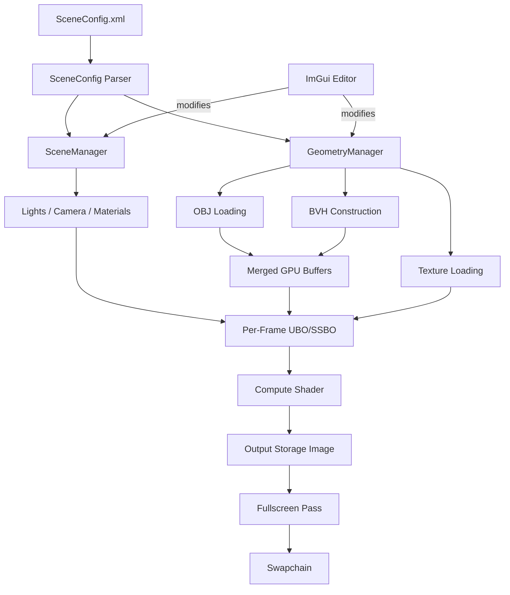
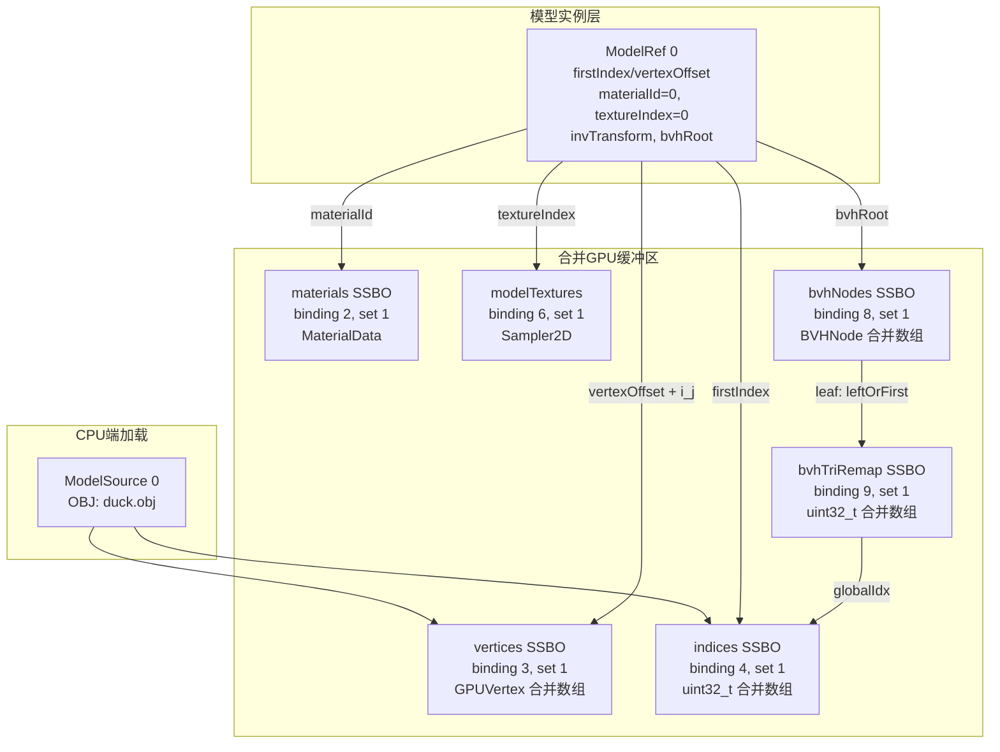
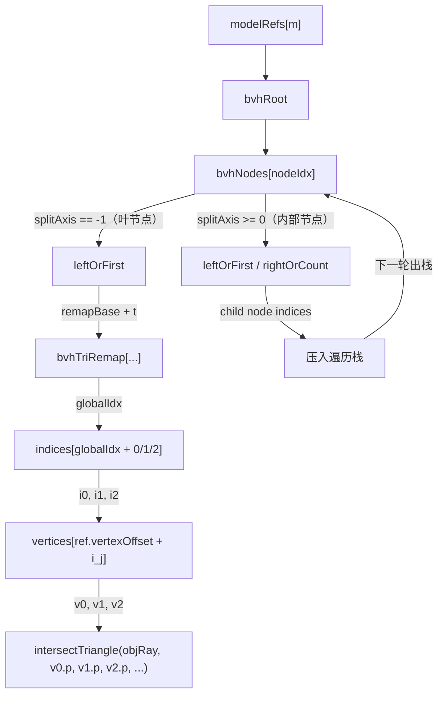
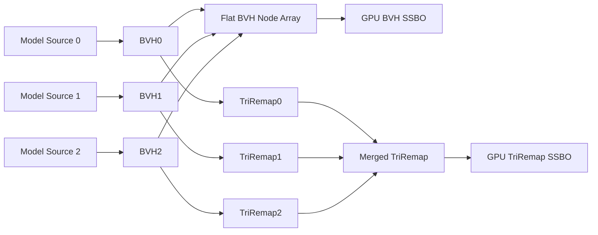
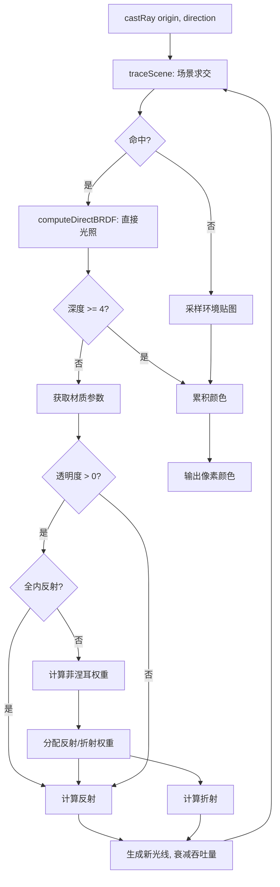
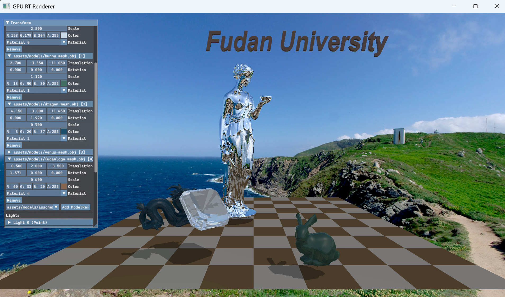
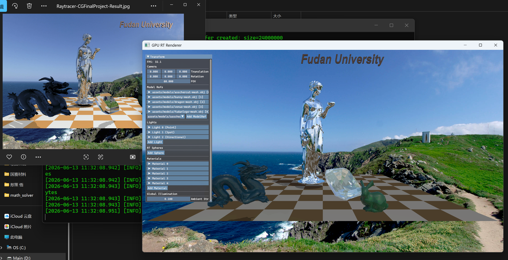
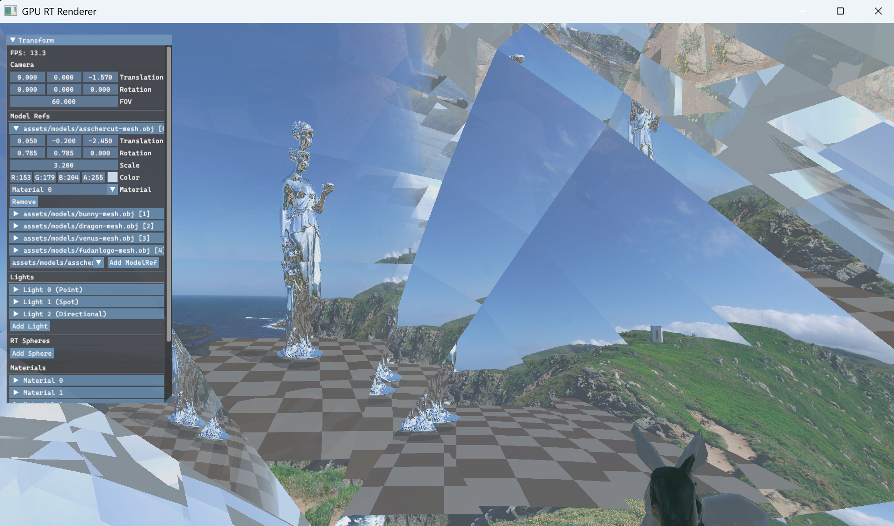
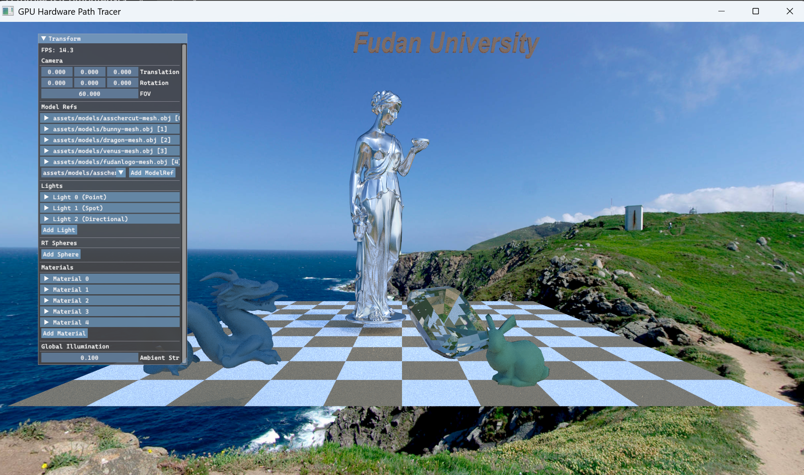

# Final-miniRTRender 实验报告

王秭研 24302010023
2026年6月15日

## 时间记录

| 阶段 | 内容 | 耗时（小时） |
|------|------|-------------|
| 环境搭建 | 配置 Vulkan SDK、CMake、Slang 编译器、GLFW 等开发环境 | 1 (复用前几个Lab) |
| 阅读资料 | 学习 Vulkan 计算管线、硬件光线追踪管线、PBR 光照模型、BVH 加速结构等 | 4 |
| RayTracing 实现 | 计算管线搭建、着色器编写、场景管理、BVH 集成、材质系统 | 12 |
| PathTracing 实现 | 硬件 RT 管线搭建、路径追踪着色器、渐进采样 | 3 (AI) |
| 调试与优化 | 性能调优、视觉缺陷修复、参数调整 | 8 |
| 报告撰写 | 实验报告编写（不含Path Tracing研究报告） | 2 |
| Path Tracing研究报告 | Part 4 所要求的内容 | 5 |
| **合计** | | 35 |

## 编译说明

### 环境要求

- Visual Studio 26（含 MSVC C++ 工具链）
- [Vulkan SDK](https://vulkan.lunarg.com/)（开发使用 1.4.335.0）
  - `Bin` 目录需加入 PATH
  - 需设置 `VULKAN_SDK` 环境变量
- CMake ≥ 3.25，Ninja，VCpkg（均已集成于VS26)

### 编译步骤

1. 在 Visual Studio 中打开仓库根目录，IDE 将自动识别 CMakePresets 并完成依赖配置
2. 在 Visual Studio 的解决方案资源管理器中选择目标项目，编译即可

仓库包含四个可编译子项目，本次 PJ 对应其中两个：

| 项目 | 说明 |
|------|------|
| **RayTracing**(重点) | 软件光线追踪（Compute Shader + BVH），本次 PJ 核心 |
| **PathTracing** | 硬件路径追踪（VK_KHR_ray_tracing_pipeline），探索性实现 |
| BlinnPhong | 前期 Lab 的传统光栅化渲染 |
| VkFromScratch | Vulkan 基础脚手架/实验项目 |


## 整体思路与实现过程

### 实验目标

本 Final Project 要求实现一个基于光线追踪技术的 miniRTRender，支持：

- 三角形法向计算与顶点法向平滑
- 基于重心坐标的顶点属性插值
- 光线与 AABB 加速求交（BVH）
- 物体几何变换（平移、旋转、缩放）
- 材质设定与光照计算
- 场景遍历与 XML 配置文件解析
- 反射、折射的递归光线追踪
- 环境映照

### 技术选型

本项目的核心决策是**放弃 CPU 路径的模板代码，选择 GPU 加速路线**。具体而言：

- **RayTracing（软件 RT）**：基于 Vulkan Compute Shader，在 GPU 上手动实现光线-三角形/球体求交、BVH 遍历以及 Whitted 风格（后升级为 PBR-inspired）的光照计算。BVH 在 CPU 端构建后上传至 GPU。
- **PathTracing（硬件 RT）**：基于 Vulkan `VK_KHR_ray_tracing_pipeline` 扩展，利用 Intel Meteor Lake 核显的硬件光线追踪加速，实现蒙特卡洛路径追踪与渐进采样。

选择 GPU 路线的动机：一方面可以获得 1.5 倍的计分权重；另一方面，实时交互（非分钟级的离线渲染）能极大提升调试效率——"看到即调试"的反馈循环对算法理解至关重要。

### 整体架构

RayTracing 与 PathTracing 两个子项目共享大量基础设施（场景管理、模型加载、材质系统、ImGui 编辑器），但在渲染核心上分道扬镳。以下重点阐述 RayTracing 的架构。



### 各模块实现

#### 计算管线搭建

这是整个项目中代码量最大、调试最困难的模块。Vulkan 计算管线的核心挑战在于描述符集（Descriptor Set）的设计——需要精确规划哪些资源绑定到哪个 set 的哪个 binding。描述符池在创建时必须提前声明各类描述符的最大配额，一旦计算错误，`vkAllocateDescriptorSets` 就会失败且报错信息极不友好。

经过多轮迭代，最终将资源划分到两套描述符集布局中。着色器端的绑定声明如下（`raytracer.slang`）：

```hlsl
// Push Constants — 高频变化的标量数据
[[vk::push_constant]] RTGlobalConstants pc;

// Set 0: 逐帧共享（Compute + Fragment 阶段均需）
[[vk::binding(0, 0)]] ConstantBuffer<CameraData> camera;
[[vk::binding(1, 0)]] StructuredBuffer<LightData> lights;

// Set 1: RT 核心资源（渲染一帧过程中不变）
[[vk::binding(0, 1)]] StructuredBuffer<Sphere>    spheres;
[[vk::binding(1, 1)]] RWTexture2D<float4>         outputImage;
[[vk::binding(2, 1)]] StructuredBuffer<Material>   materials;
[[vk::binding(3, 1)]] StructuredBuffer<GPUVertex>  vertices;
[[vk::binding(4, 1)]] StructuredBuffer<uint>       indices;
[[vk::binding(5, 1)]] StructuredBuffer<ModelRef>   modelRefs;
[[vk::binding(6, 1)]] Sampler2D modelTextures[8];
[[vk::binding(7, 1)]] Sampler2D envmap;
[[vk::binding(8, 1)]] StructuredBuffer<BVHNode> bvhNodes;
[[vk::binding(9, 1)]] StructuredBuffer<uint> bvhTriRemap;
```

**Set 0 — 逐帧共享**：

| Binding | Vulkan 类型 | 资源 | 说明 |
|---------|------------|------|------|
| 0 | Uniform Buffer | CameraData（64 字节） | viewProj + invViewProj + 摄像机世界坐标 |
| 1 | Storage Buffer | LightData[] | 最多 16 个光源，含 type/position/color/intensity/direction 等 |

**Set 1 — RT 核心资源**：

| Binding | Vulkan 类型 | 数量 | 资源 | 说明 |
|---------|------------|------|------|------|
| 0 | Storage Buffer | 1 | SphereData[] | 球体中心、半径、材质索引 |
| 1 | Storage Image | 1 | RGBA8 2D | Compute 直接写入的渲染结果 |
| 2 | Storage Buffer | 1 | MaterialData[] | 漫反射色、金属度、粗糙度、透明度、IOR、自发光 |
| 3 | Storage Buffer | 1 | GPUVertex[] | 合并后全部顶点（position + normal + texCoord, 48B/std430） |
| 4 | Storage Buffer | 1 | uint32_t[] | 合并后全部三角形索引 |
| 5 | Storage Buffer | 1 | ModelRef[] | 每个实例的变换、材质引用、几何偏移、BVH 根节点等 |
| 6 | Sampler2D | 8 | modelTextures[] | 模型纹理数组，通过 ModelRef 中的 textureIndex 索引 |
| 7 | Sampler2D | 1 | envmap | 等距矩形环境贴图，用于背景映照 |
| 8 | Storage Buffer | 1 | BVHNode[] | 合并后的 BVH 节点数组（AABB + 子节点引用, 48B/std430） |
| 9 | Storage Buffer | 1 | uint32_t[] | BVH 三角形重映射表，将叶节点局部索引映射到全局索引缓冲区 |

C++ 端，`DescriptorManager` 据此反向推导描述符池配额：

```cpp
// Pool 配额 = framesInFlight × 每帧需求量
poolSizes[0] = { eUniformBuffer,         framesInFlight * 1 };
poolSizes[1] = { eCombinedImageSampler,  framesInFlight * (maxTextures + 2) };
poolSizes[2] = { eStorageBuffer,         framesInFlight * 8 };
poolSizes[3] = { eStorageImage,          framesInFlight * 1 };
maxSets      = framesInFlight * 4;  // perFrame + rtResource + fullscreen + ImGui
```

Push Constants 传递 5 个 uint32 + 1 个 float（`RTGlobalConstants`），包括 sphereCount、lightCount、materialCount、modelRefCount 和 ambientStrength。这些值每帧可能随场景编辑而变化，用 push constants 比 UBO 更高效——不需要创建 buffer、不需要 descriptor write。

全屏显示 pass 使用独立的第三套布局（单 binding: combined image sampler），通过一个由 `SV_VertexID` 生成的全屏三角形将 RT 输出采样到 swapchain。

#### 场景管理与几何数据

场景数据的组织是 ray tracing 着色器高效运行的基础。核心挑战在于：多个 OBJ 模型被加载为离散的顶点/索引数据，但 GPU 着色器期望通过少数几个连续的 SSBO 访问全部几何体，同时每个模型实例需要独立引用自己的数据区间、材质、变换和 BVH。为此，引入了一个分层的数据引用结构。

**数据层次关系**：



关键数据结构定义（C++ 端，按 std430 对齐，与着色器端一致）：

```cpp
// 顶点：48 字节，std430 对齐
struct GPUVertex {
    alignas(16) glm::vec3 position;  // offset 0
    alignas(16) glm::vec3 normal;    // offset 16
    glm::vec2 texCoord;              // offset 32
    float _pad[2];                   // -> 48 bytes
};

// 模型实例引用：128 字节
struct ModelRef {
    uint32_t firstIndex;    // 在合并索引缓冲中的起始偏移
    uint32_t indexCount;    // 索引数量（三角形数 × 3）
    uint32_t vertexOffset;  // 在合并顶点缓冲中的起始偏移
    uint32_t materialId;    // -> materials[materialId]
    glm::mat4 invTransform; // world→object space（光线变换用）
    glm::vec4 color;        // per-instance tint
    glm::vec3 boundingSphereCenter; // object space
    float boundingSphereRadius;
    int32_t textureIndex;   // -1 = 无纹理, >=0 = modelTextures[index]
    int32_t bvhRoot;        // -> bvhNodes[bvhRoot]（BVH 遍历起点）
};

// BVH 节点：48 字节（内部节点与叶节点共用）
struct BVHNode {
    glm::vec3 bboxMin;      // AABB 最小角
    glm::vec3 bboxMax;      // AABB 最大角
    int32_t leftOrFirst;    // 内部节点: 左子节点索引; 叶: 三角形在 triRemap 中的起始偏移
    int32_t rightOrCount;   // 内部节点: 右子节点索引; 叶: 三角形数量
    int32_t splitAxis;      // -1 = 叶节点, 0/1/2 = 内部节点分割轴
};
```

**合并流程**（`GeometryManager::createGeometryBuffers()`）：

1. 所有 ModelSource 的顶点拼接为一个 `GPUVertex[]` 数组，索引拼接为一个 `uint32_t[]` 数组，记录每个 source 的 `vertexOffset` 和 `firstIndex`
2. 将这些偏移量填入对应 ModelRef（通过 `modelRefSourceIdx` 映射找到哪些 ModelRef 引用同一个 ModelSource）
3. `postProcessBVH()` 将各 source 的独立 BVH 合并为扁平数组：内部节点的子节点索引加上全局节点偏移，叶节点的 `leftOrFirst` 改为在合并 `bvhTriRemap` 中的偏移；`bvhTriRemap` 中的值也同步从局部索引转为全局索引偏移（`firstIndex + localTri * 3`）
4. 所有缓冲区一次性创建并通过 `copyFrom` 上传至 GPU

着色器中的访问链（`traceScene()` 函数中遍历模型时）：



这种设计的关键优势：所有模型共享同一组 SSBO 绑定，着色器通过 ModelRef 中的偏移量和引用间接寻址，无需每模型切换描述符集，使得单次 dispatch 即可渲染含多个模型的完整场景。

#### BVH 加速结构

BVH 是实时渲染的关键。本项目使用表面积启发式（Surface Area Heuristic, SAH）在 CPU 端构建 BVH，16-bin 分箱策略选择最优分割平面，叶节点最多包含 4 个三角形。

构建完成后，所有模型源的独立 BVH 被合并为扁平数组（flat array），节点索引全局偏移，三角形重映射表将局部三角形索引映射到全局索引缓冲区偏移。着色器遍历时使用显式栈（最大深度 64），对每个 BVH 节点执行 slab 法 AABB 求交，叶子节点则遍历三角形列表。

加入 BVH 后性能提升约 50 倍（从约 0.4 fps 提升至约 20 fps，1080P 分辨率），使得实时交互成为可能。



#### PBR-inspired 光照模型

期末 PJ 要求实现 Whitted 风格光照（环境光 + 漫反射 + 镜面高光），但为了更真实的视觉效果，本项目在着色器中实现了一个简化的 Cook-Torrance 微面元 BRDF：

- **法线分布函数**：Trowbridge-Reitz（GGX），由 roughness 参数控制高光形态
- **几何遮蔽函数**：Smith 模型配合 Schlick-GGX
- **菲涅耳反射**：Schlick 近似，F0 在电介质（0.04）和金属（base color）之间插值
- **能量守恒**：漫反射权重 kD = (1 - F) * (1 - metallic)

Whitted 风格参数（albedo RGBA + shininess）到 PBR 参数（metallic、roughness、transparency、ior）的转换在 `SceneConfig.cpp` 中完成：reflectivity 映射为 metallic，shininess 通过公式 `roughness = sqrt(2.0 / (shininess + 2.0))` 转换，alpha 通道控制透明度。

#### 光线追踪核心

着色器 `raytracer.slang` 中的 `castRay()` 函数使用**迭代栈**管理光线路径。之所以不采用直观的递归写法，是因为 Slang 编译器似乎不允许我这么干。

```hlsl
struct CastRayStackNode {
    Ray ray;
    float3 throughput;  // 当前路径的能量衰减因子
    int depth;          // 递归深度
};

float3 castRay(Ray rayInitial) {
    float3 color = float3(0.0);
    CastRayStackNode stack[17];  // 最大深度4, 2^4+1=17
    int stackPtr = 0;
    stack[stackPtr] = { rayInitial, float3(1.0), 0 };
    stackPtr += 1;

    while (stackPtr > 0) {
        stackPtr -= 1;
        // 出栈一条光线，执行求交、着色、生成反射/折射光线并入栈
        ...
        if (hasRefractRay && stackPtr < 16)
            stack[stackPtr++] = { refractRay, refractThroughput, depth+1 };
        if (hasReflectRay && stackPtr < 16)
            stack[stackPtr++] = { reflectRay, reflectThroughput, depth+1 };
    }
    return color;
}
```

每步弹出一条光线后依次：场景求交 → 直接光照计算 → Snell 定律判定全内反射 → Schlick 菲涅耳分配反射/折射权重 → 将生成的次级光线压入栈顶。栈的最大深度设为 17（理论最大为 `2^(maxDepth+1) - 1 = 31`，但实际中反射/折射分叉不会填满所有路径，17 已足够）。



### PathTracing（硬件 PT）简述

PathTracing 子项目使用 Vulkan 硬件光线追踪管线（`VK_KHR_ray_tracing_pipeline`）。与软件 RT 的核心区别在于：

- 使用 TLAS/BLAS 双层加速结构替代手工 BVH，由 GPU 固定功能单元完成光线-三角形求交
- 着色器拆分为 raygen（光线生成 + 蒙特卡洛采样）、closest-hit（几何数据提取）、miss（环境贴图/地面）、shadow-miss（阴影检测）四个独立阶段
- 实现蒙特卡洛路径追踪：每像素每帧 4 条光线，GGX 重要性采样、NEE（Next Event Estimation）、俄罗斯轮盘赌、渐进累积
- 累积缓冲区（R32G32B32A32）在相机或场景变化时重置，实现画面随时间收敛

该部分主要为探索性实现，展示 GPU 硬件 RT 管线的应用，不作为本次 PJ 的核心提交内容。

### Base Code 的作用

本项目的 RayTracing 部分未使用教学团队提供的 tinyraytracer 模板代码（因选择 GPU 路线），但 tinyraytracer 的原理讲解（特别是光线-三角形 Möller-Trumbore 算法、反射/折射公式推导、菲涅耳方程）为着色器编写提供了理论基础。PathTracing 部分的硬件 RT 管线参考了 Vulkan SDK 官方示例和社区开源项目。

## 问题与解决方案

### Vulkan 计算管线搭建（最困难）

**现象**：描述符集布局与着色器绑定不匹配导致验证层报错（`VUID-vkCmdDispatch-descriptorType-*`），管线无法运行。Debug 信息指向 `VkDescriptorType mismatch` 或 `descriptorCount exceeded`。

**原因**：Vulkan 描述符池需在创建时精确指定各类描述符的最大数量（storage buffer、storage image、combined image sampler 等）。本项目需要约 10 种不同绑定，资源类型多样，初始估计值与实际需求严重不符。此外，需要同时管理 multiple descriptor sets 的更新生命周期。

**解决**：将所有 Vulkan 描述符管理工作集中到 `DescriptorManager` 类中。先完整列出着色器中的所有 `[[vk::binding(N, set)]]` 声明，反向推导出描述符池所需的各类型配额。使用 validation layer 的详细输出逐条排查绑定号与类型的不一致。

### BVH 引入后模型表面碎片化

**现象**：加入 BVH 加速后，画面中模型表面出现"棋盘格"式的碎片——每隔一个三角形正常显示，另一个三角形消失。

**原因**：单个三角形在顶点/索引缓冲区中被 BVH 局部三角形索引引用，但 BVH 构建时使用的是模型源内部的局部索引。合并多模型几何缓冲区后，若三角形重映射表未正确将局部索引偏移到全局索引缓冲区中，着色器将读取错误的顶点数据。具体 bug 位于 `postProcessBVH()` 中构建 `bvhTriRemap` 的逻辑——局部三角形索引 `localTri` 应映射为 `firstIndex + localTri * 3`，而非直接使用局部值。

**解决**：修正三角形重映射表的构建，确保每个模型源的 BVH 叶节点中的三角形索引正确指回全局索引缓冲区。验证方式：在简单场景（单个模型）中逐一验证三角形的顶点数据。

### 模型法线缺失

**现象**：部分 OBJ 模型文件不包含顶点法线数据。后续着色器中 `GPUVertex::normal` 全部为零向量，导致光照计算失效，渲染结果呈现纯平面着色。

**解决**：在 `GeometryManager` 中增加 `computeSmoothNormalsIfNeeded()` 函数——检测法线数据是否为空，若为空则先计算面法线（三角形两边叉积），再对每个顶点累加其所属的所有面的法线并归一化，得到平滑顶点法线。

### 项目收获

通过本项目，对以下概念的理解显著加深：

- **光线追踪的物理基础**：从 Whitted 递归模型到 Cook-Torrance 微面元 BRDF，理解光与表面的交互如何用数学建模——法线分布（微面元朝向分布）决定高光形态，几何遮蔽决定掠射角能量衰减，菲涅耳方程决定反射/折射能量分配。
- **加速结构的重要性**：亲身经历从 0.4 fps 到 20 fps 的 50 倍加速，直观理解 BVH 如何将 O(n) 的光线-三角形求交降到 O(log n)。BVH 的遍历栈、AABB slab 求交、SAH 分箱策略等不再仅是书本概念。
- **GPU 编程范式的约束**：计算着色器要求一切数据通过描述符显式绑定，无全局变量、无递归、内存访问模式影响性能——这些约束迫使我重新思考"如何在 GPU 上表达光线追踪"。
- **实时视觉调试的价值**：能够即时调整材质参数、光源位置并观察效果变化，这种交互式反馈极大加速了对算法原理的理解。比"改参数 → 离线渲染分钟级等待 → 查看结果"的流程高效百倍。

## 实验结果

### 环境配置

- 操作系统：Windows 11 Pro
- GPU：Intel Arc Graphics (Ultra 9 185H 核显)
- API：Vulkan 1.4, Slang
- 分辨率：1920 x 1080

### 画面效果


RayTracing 渲染结果


RayTracing和基准程序渲染对比（由于法线平滑不同，所以存在一定渲染差异）


在透明物体中观察世界，很有意思


PathTracing效果，真实的漫反射，但存在一些噪点

### 性能数据

| 模式 | 帧率（1080P） | 加速方式 |
|------|--------------|---------|
| 软件 RT（无 BVH） | ~0.4 fps | 无 |
| 软件 RT（有 BVH） | ~20-30 fps | CPU SAH BVH + GPU 遍历 |
| 硬件 PT | ~20 fps | GPU 硬件加速结构 (TLAS/BLAS) |

## Part 4：Path Tracing 技术工业应用报告

见另附pdf文件。