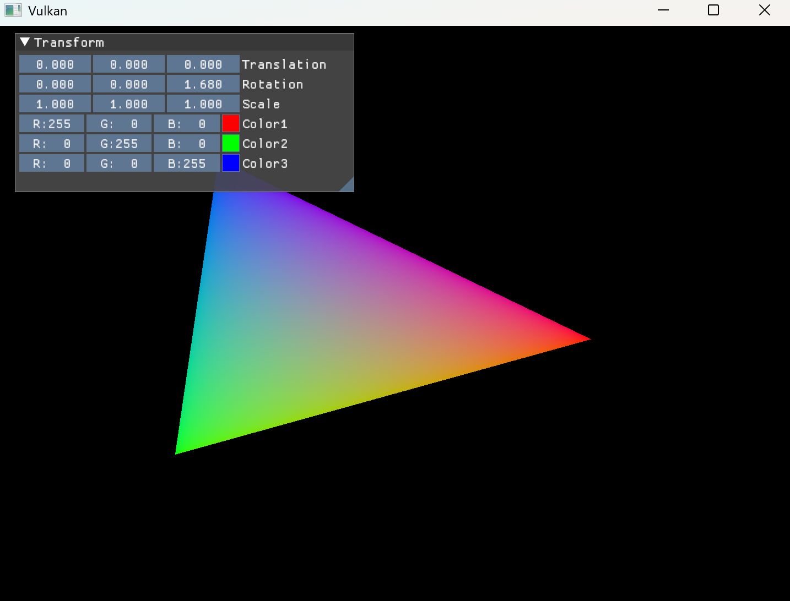

# Lab 1 Report

Wang, Ziyan  24302010023
2026.04.08

## Triangle - 'Hello world' for Vulkan!

See `./Lab1Triangle`.

You can use integrated Dear ImGui panel to adjust the colors of transform for the triangle.



I DIDN'T use the meterial given in the VKT_09.zip. Instead, I follow the instructions of the tutorial on the [Vulkan Tutorial Website](https://docs.vulkan.org/tutorial/latest/00_Introduction.html).

I followed from [Introduction part](https://docs.vulkan.org/tutorial/latest/00_Introduction.html) to [Vertexbuffer Creation](https://docs.vulkan.org/tutorial/latest/04_Vertex_buffers/01_Vertex_buffer_creation.html) part and finish `Lab1Triangle` executable.

I also add [Dear ImGui](https://github.com/ocornut/imgui) library to it so that it provides a visual debugging interface for transform and color.

## Vibe Coding leveraging Claude Code & CodeArts

See `./RayTracing` (though it is just a triangle).

Well, the vibe coding process of using claude code is deleted, and here are the prompts which I can remember:

```
使用Vulkan 1.4 完成一个完整的、可扩展的三角形绘制程序，
遵循 Vulkan 应用的Common Practice。首先列出文件结构与规划。
...
按照规划完成这个Vulkan三角形，包括CMakeLists, 所有源文件与头文件, Shader。
你不需要帮我编写测试脚本、编译程序，如果你认为完成了，就告诉我让我来测试。
...
修复这些编译错误。
...
修复这些验证层错误。
...
你是一个资深Vulkan工程师，帮我严格找一找这里面有没有bug、逻辑漏洞、与Vulkan最佳实现不符合的模式、反模式等
```

And I also use CodeArts (sponsored by Huawei), to refactor the whole `RayTracing` to vulkan::raii style. For example,

```
用vk::raii风格重构./RayTracing/src
...
你没有重构Application.cpp/hpp
...
你也没有重构VulkanRenderer.cpp/hpp window/WindowManager.hpp/cpp main.cpp
...
还有VulkanMacros.hpp
...
D:\projects\ComputerGraphicsLecture\RayTracing\src\vulkan\Validation.cpp(17): error C2440: “<function-style-cast>”: 无法从“const vk::ArrayWrapper1D<char,256>”转换为“std::string”...
...
没有与参数列表匹配的构造函数...
...
你是一个精湛又严厉的软件工程+计算机图形学开发。审阅./RayTracing的代码，检查：1. 它是否正确是用了vulkan raii api，实现了三角形的绘制。2. 有没有逻辑漏洞 3. 有没有危险的操作、反模式、坏味道、不符合vulkan raii实践的方法。提示：现在的版本可以正确运行，但是你依然要检查上面几点。
...
之前，agent告知我下面的代码问题 必须修改（影响功能或正确性）。...作为一个精湛的软件工程师和图形工程师，你检查一下有没有正确。此外，继续仔细检查其他方面。
...
按照下面的方案修复： 一. 问题: Index Buffer 未使用。
...
```

Screenshots and validation layer outputs:


## How to build and compile

### Prerequisite

- VCpkg
- Vulkan SDK (1.4.335.0 tested)
	- `Bin` directory should be added to path
	- `VULKAN_SDK` should be added to environment variables
- CMake > 3.20

### Build

- Copy `CMakePresets.json.example` to `CMakePresets.json`
- Modify `[path-to-vcpkg]` to your path to vcpkg in `"CMAKE_TOOLCHAIN_FILE": "[path-to-vcpkg]/scripts/buildsystems/vcpkg.cmake"`  
- Open the directory in Visual Studio
- It will configure all dependencies
- Build RayTracing or Lab1Triangle in Visual Studio