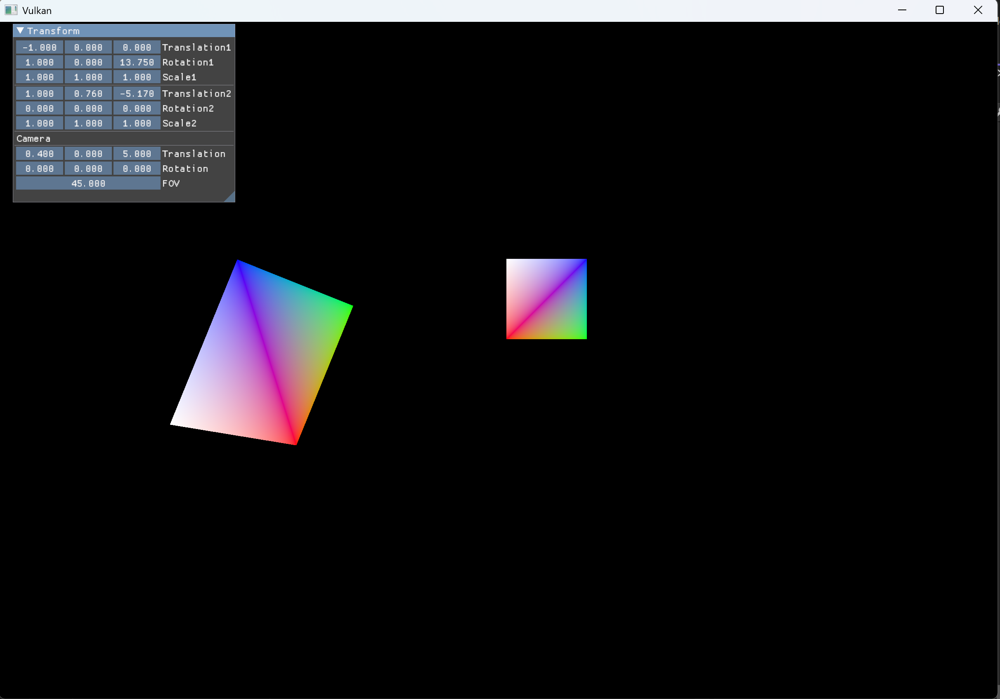

# Lab 1 Report

Wang, Ziyan  24302010023
2026.04.21

## Quad

See `./Lab1Triangle`.

You can use integrated Dear ImGui panel to adjust the transforms of the quads. Also, you can adjust the transform of the camera!



I DIDN'T use the meterial given in the 09_VTK_lab2.zip or Lab2-VulkanTwoQuads.zip. Instead, I continue to use my Lab 1 program and add index buffers and uniform buffers, following the instructions of the tutorial on the [Vulkan Tutorial Website](https://docs.vulkan.org/tutorial/latest/04_Vertex_buffers/03_Index_buffer.html).

I followed from [Staging Buffer](https://docs.vulkan.org/tutorial/latest/04_Vertex_buffers/02_Staging_buffer.html) through [Descriptor pool and sets](https://docs.vulkan.org/tutorial/latest/05_Uniform_buffers/01_Descriptor_pool_and_sets.html) part.

## Statement

I did not vibe coding - at least I did not use claude.

But yes, I sought for help from LLMs, including this doc.

## How to build and compile

### Prerequisite

- VCpkg
- Vulkan SDK (1.4.335.0 tested)
	- `Bin` directory should be added to path
	- `VULKAN_SDK` should be added to environment variables
- CMake > 3.20

### Build

- Copy `CMakePresets.json.example` to `CMakePresets.json`
- Modify `[path-to-vcpkg]` to your path to vcpkg in `"CMAKE_TOOLCHAIN_FILE": "[path-to-vcpkg]/scripts/buildsystems/vcpkg.cmake"`  
- Open the directory in Visual Studio
- It will configure all dependencies
- Build RayTracing or VkFromScratch in Visual Studio

VkFromScratch is the work for this lab.

## Difficulties I encountered

### What kind of buffer to choose?

In Vulkan we have two common types of buffers for vertex data:

- Host‑visible buffers, which can be modified easily, but not so efficient.
- Device‑local buffers – reside in GPU memory, require a staging copy (so not useful for dynamic data), but offer the best performance

The [official tutorial](https://docs.vulkan.org/tutorial/latest/04_Vertex_buffers/02_Staging_buffer.html) recommends the latter for static geometry.  
For our quad’s vertex data (positions and colours) we therefore use a **staging buffer** followed by a **device‑local vertex buffer**:

```cpp
vk::BufferCreateInfo stagingInfo{ .size = bufferSize, .usage = vk::BufferUsageFlagBits::eTransferSrc };
vk::raii::Buffer stagingBuffer(device, stagingInfo);
// ... allocate memory, map, copy vertex data ...

vk::BufferCreateInfo bufferInfo{ .size = bufferSize, 
                                 .usage = vk::BufferUsageFlagBits::eVertexBuffer | vk::BufferUsageFlagBits::eTransferDst };
vertexBuffer = vk::raii::Buffer(device, bufferInfo);
copyBuffer(stagingBuffer, vertexBuffer, stagingInfo.size);
```

However, we need to **frequently update the position of each quad** (transformation matrix).  
For that we turn to [instanced rendering](###instrdr) and store the per‑instance data in **host‑visible, host‑coherent buffers**. This allows us to write new transform matrices every frame without expensive copies.

Because we use multiple frames in flight, we create one instance buffer per frame and map it persistently:

```cpp
for (size_t i = 0; i < MAX_FRAMES_IN_FLIGHT; i++) {
    createBuffer(instanceBufferSize,
                 vk::BufferUsageFlagBits::eVertexBuffer,
                 vk::MemoryPropertyFlagBits::eHostVisible | vk::MemoryPropertyFlagBits::eHostCoherent,
                 m_instanceBuffers[i], m_instanceBufferMemory[i]);
    m_mappedInstanceData[i] = m_instanceBufferMemory[i].mapMemory(0, instanceBufferSize);
}
```

Each frame writes its own instance data into the mapped pointer, and proper synchronisation (fences) ensures that the GPU does not read a buffer that is still being written by the CPU.

### Instanced Renderer
<a id="instrdr"></a>

To render many quads with different transformations efficiently, we use **instanced rendering**.  
We define two vertex input bindings:

| Binding | Stride            | Input rate           | Description            |
|---------|-------------------|----------------------|------------------------|
| 0       | `sizeof(Vertex)`  | `eVertex`            | per‑vertex data (local position & colour) |
| 1       | `sizeof(QuadInstanceData)` | `eInstance` | per‑instance data (4×4 transform matrix) |

The vertex attributes are described as follows:

- Attributes 0 and 1 come from binding 0 (vertex position and colour).
- Attributes 2, 3, 4, 5 come from binding 1 – each row of the 4×4 matrix is a `vec4` occupying one attribute location.

```cpp
vk::VertexInputBindingDescription vertexBinding{ .binding = 0, .stride = sizeof(Vertex), .inputRate = vk::VertexInputRate::eVertex };
vk::VertexInputBindingDescription instanceBinding{ .binding = 1, .stride = sizeof(QuadInstanceData), .inputRate = vk::VertexInputRate::eInstance };

for (int i = 0; i < 4; i++) {
    attributeDescriptions[2 + i].binding = 1;
    attributeDescriptions[2 + i].location = 2 + i;
    attributeDescriptions[2 + i].format = vk::Format::eR32G32B32A32Sfloat;
    attributeDescriptions[2 + i].offset = offsetof(QuadInstanceData, transform) + sizeof(glm::vec4) * i;
}
```

When recording the command buffer, we bind **both** buffers together:

```cpp
const std::array<vk::Buffer, 2> vertexBuffers{ m_vertexBuffer, instanceBuffer };
constexpr std::array<vk::DeviceSize, 2> offsets{ 0, 0 };
commandBuffer.bindVertexBuffers(0, vertexBuffers, offsets);
commandBuffer.bindIndexBuffer(m_indexBuffer, 0, vk::IndexType::eUint16);
// ... bind descriptor sets, then draw indexed with instance count
```

The pipeline vertex input state combines the two bindings and all six attribute descriptions.

### UniformBuffer – Camera!

The camera’s view‑projection matrix changes every frame (or when the camera moves). We use a **uniform buffer** to pass this matrix to the shader.  
As with instance data, we create one uniform buffer per frame in flight, map it persistently, and update it just before rendering.

```cpp
// Create per‑frame uniform buffers (host visible, coherent)
for (size_t i = 0; i < MAX_FRAMES_IN_FLIGHT; i++) {
    createBuffer(sizeof(CameraData),
                 vk::BufferUsageFlagBits::eUniformBuffer,
                 vk::MemoryPropertyFlagBits::eHostVisible | vk::MemoryPropertyFlagBits::eHostCoherent,
                 m_uniformBuffers[i], m_uniformBuffersMemory[i]);
    m_uniformBuffersMapped[i] = m_uniformBuffersMemory[i].mapMemory(0, sizeof(CameraData));
}
```

A descriptor pool with one `eUniformBuffer` descriptor per frame is created.  
For each frame we allocate a descriptor set and write the corresponding uniform buffer into binding 0:

```cpp
vk::DescriptorBufferInfo bufferInfo{ .buffer = m_uniformBuffers[i], .offset = 0, .range = sizeof(CameraData) };
vk::WriteDescriptorSet descriptorWrite;
descriptorWrite.dstSet = m_descriptorSets[i];
descriptorWrite.dstBinding = 0;
descriptorWrite.descriptorType = vk::DescriptorType::eUniformBuffer;
descriptorWrite.setBufferInfo(bufferInfo);
m_device.updateDescriptorSets(descriptorWrite, nullptr);
```

Every frame we compute the current camera’s view‑projection matrix and copy it into the mapped memory of the current frame’s uniform buffer:

```cpp
CameraData data({ m_camera.GetViewProj() * glm::inverse(m_cameraTransform()) });
memcpy(m_uniformBuffersMapped[currentFrame], &data, sizeof(data));
```

In the slang shader the buffer is declared as a constant buffer and used to transform the vertex position:

```slang
struct CameraData { float4x4 viewProjection; };
[[vk::binding(0)]] ConstantBuffer<CameraData> cameraBuffer;

VSOutput vertMain(VSInput input) {
    VSOutput output;
    output.pos = mul(cameraBuffer.viewProjection, mul(input.transform, float4(input.localPos, 1.0)));
    output.color = input.vertexColor;
    return output;
}
```

This design allows the camera matrix to be updated efficiently while keeping the GPU’s read access fast.