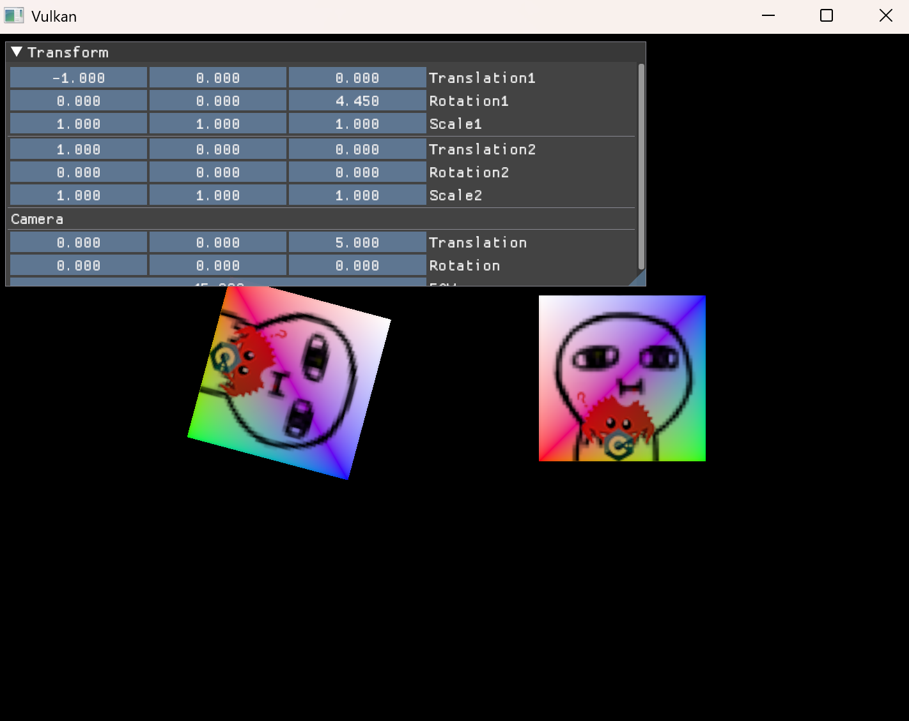
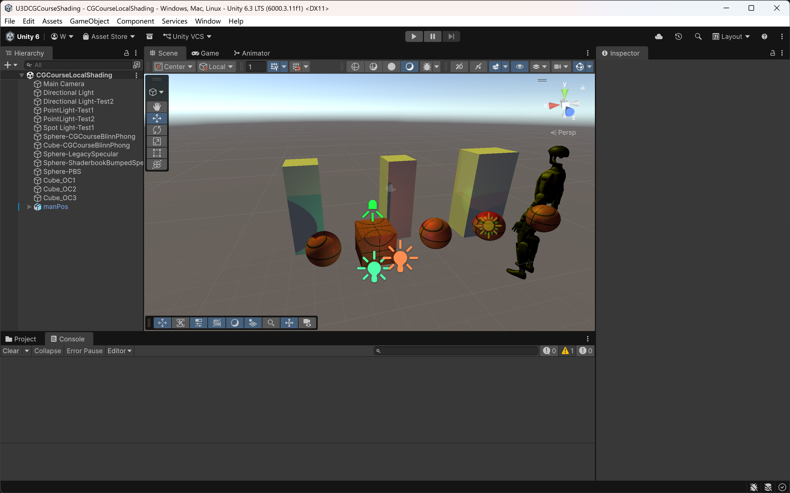
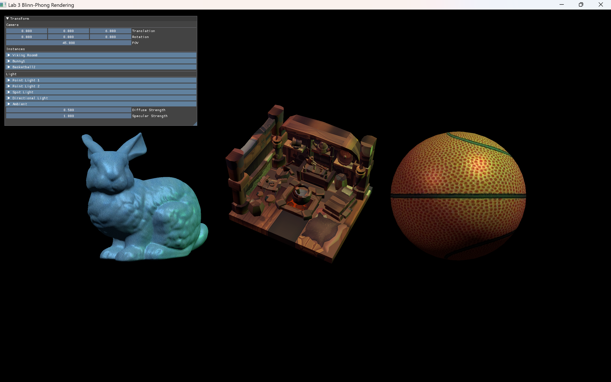
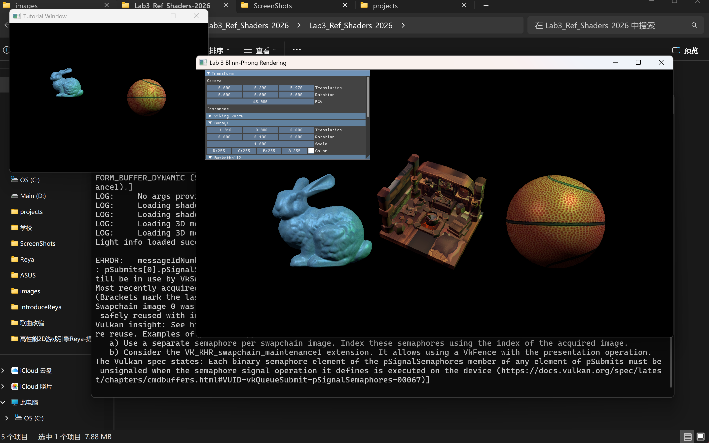
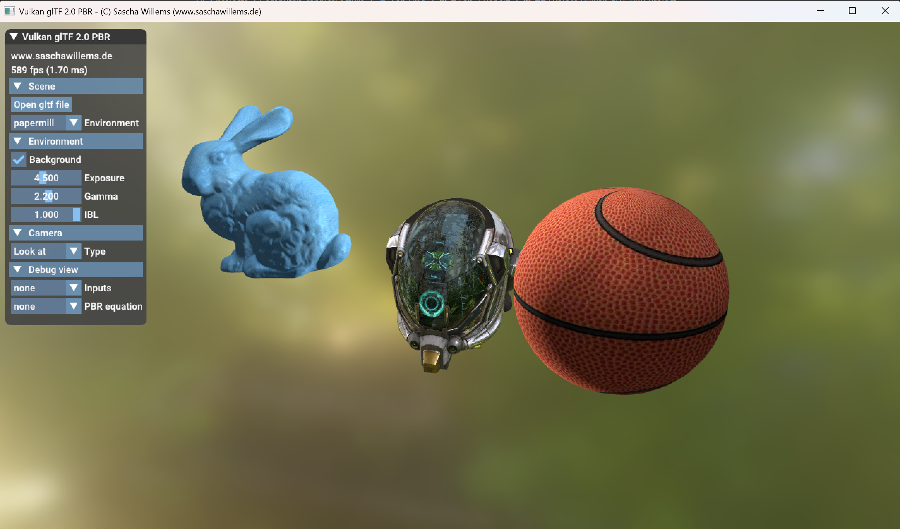

# Lab 3 Report

## Overview

Based on the lab requirement, I implemented multi-light Blinn-Phong rendering, including light definition, shader, and C++ code.

I implemented model loading, light info definition, and shader **from scratch**. That is to say, I did not use the project template given. Instead, I continued to add some code to what I had done in Lab 2, including:
- texture, and its descriptor sets
- model loading
- modified instanced rendering
- light object abstraction
- `tinyobjloader` library integration
- light shader implementation (diffuse lights), including point light, spot light, and directional light
- Blinn-Phong algorithm implementation (specular lights)

### Statement

I did not vibe code - at least I did not let a coding agent do everything for me.

But yes, I sought help from LLMs, including for this document.

## What I did before implementing lighting

First, I read [**Vulkan tutorial**](https://mysvac.github.io/vulkan-hpp-tutorial/md/) from *texture mapping* through *loading models*.

I spent a lot of time learning how to apply textures to the quad from Lab 2 (you can see the `VkFromScratch` subproject).



Next, I **load models** following the tutorial's instructions.
I used the model and texture provided by the tutorial (the Viking room).

This step is much simpler. But I still spent some time doing chores such as abstracting the `Model` class (see `Model.h/cpp`) - of course, without any lighting at this step.

Well, before doing the above, I also checked the Unity project provided.

But well, that project did not help me understand what I should eventually achieve. What I understood was - "Some lights, isn't it?" :P
So I checked the [Unity documentation](https://docs.unity.cn/2022.3/Documentation/Manual/UnityManual.html). I learned that there are several rendering pipelines in Unity and something called *forward rendering*, but I was still confused :-(.
Nevertheless, I better understood how Unity renders the scene, and I generally know how to choose different rendering pipelines.

Then I started to implement the lighting logic.

## How I implemented lighting

I did not like the provided material (project template). 
First, I failed to compile it. It seemed that I needed to manually configure linking to external libraries, which was verbose. Also, I did not like the way light objects were arranged:
```c++
struct LightInfo
{
    // point light1
    alignas(16) glm::vec3 lightPos;
    alignas(16) glm::vec3 lightColor;
    alignas(16) glm::vec3 viewPos;
    alignas(16) glm::vec3 lightArgs;   //x: light intensity, y: max distance

    // point light2
    alignas(16) glm::vec3 lightPos_2;
    ...

    //spot light
    ...

    alignas(16) glm::vec4 ambientArgs;  // ambeintcolor = (x, y, z), w : strength
    alignas(16) glm::vec3 strength;  //x: diffuse strength y: specular strength
 
};
```

The specular components for lights were mixed and hard to extend, and it used aligned `vec3` everywhere, which was confusing and did not provide clear semantics. At least it should be abstracted like this (what I did):

```c++
   struct PointLightInfo {
       alignas(16) glm::vec3 pos;
       alignas(16) glm::vec3 color;
       float intensity;
       float maxDistance;
       char padding[8];
   };
   struct SpotLightInfo {
       ...
   };
   struct DirectionalLight {
       ...
   };
   struct LightInfo
   {
       alignas(16) PointLightInfo pointLight1;.
       alignas(16) SpotLightInfo spotLight;
       ...
       alignas(16) glm::vec4 ambientArgs;
       float diffuseStrength;
       float specularStrength;
       char padding[8];
   };
```
The better way is to abstract the Light object using OOP, but I thought I didn't need to do such things for this lab.

What's more, I did not want to use VulkanLaunchpad because I preferred to use RAII-style Vulkan and write the logic by hand. I also have my own camera and transform definition.

Nevertheless - I knew nothing about lighting, so I started to read the simple lighting implemented in the provided GLSL shader, and I added some comments to help me understand, like this:
```glsl
// 环境光颜色和强度
vec3 ambient = light.ambientArgs.w /* strength */ * vec3(light.ambientArgs.x, light.ambientArgs.y, light.ambientArgs.z) /* color */;

// point light 1
float lightToPosDistance = distance(light.lightPos, fragPos); // 光到片元的距离
// attenuation: 衰减，intensity：强度
// 衰减之后的强度
float lightAttenuation = light.lightArgs.x /* intensity */ / (1 + lightToPosDistance * lightToPosDistance);
    
// 超过最大距离归零
if (lightToPosDistance > light.lightArgs.y){
    lightAttenuation = 0.0f;
}
// diffuse 漫反射 specular 镜面反射
float diffuseStrength = light.strength.x /* diffuse */;
vec3 norm = normalize(fragNormal); // for safe, 单位化之后的法线
vec3 lightDir = normalize(light.lightPos  - fragPos); // 从光源指向片元
float diff = max(dot(norm, lightDir), 0.0); // 夹角
vec3 diffuse = diffuseStrength * diff * light.lightColor; // 漫反射强度 * 有多少是有效的 * 颜色 

vec3 pointResult_1 = diffuse  * lightAttenuation; // 距离衰减后的漫反射强度
    
vec3 totalLight = pointResult_1 + ambient; // 加上环境光
totalLight = min(totalLight, vec3(3.0)); // 不要太炸
outColor = vec4(totalLight * texture(texSampler, fragTexCoord).rgb, 1.0);

}
```

### Diffuse Part

First I migrated it to a Slang shader using my own definitions and structs:
```slang
float getDistanceAttenuation(float3 position, float3 fragPos, float intensity, float maxDistance) {
    float lightToPosDistance = distance(position, fragPos);
    float lightAttenuation = intensity / (1 + lightToPosDistance * lightToPosDistance);
    if (lightToPosDistance > maxDistance){
        lightAttenuation = 0.0;
    }
    return lightAttenuation;
}
float3 getDiffuse(float3 norm, float3 lightDir, float diffuseStrength) {
    float cosAngle = max(dot(norm, lightDir), 0.0);
    return diffuseStrength * cosAngle; 
}
// point light 1
float3 pointResult_1;
{
    float lightAttenuation = getDistanceAttenuation(
        lightInfo.pointLight1.position,
        vertIn.fragPos,
        lightInfo.pointLight1.intensity,
        lightInfo.pointLight1.maxDistance
    );

    float3 lightDir = normalize(lightInfo.pointLight1.position - vertIn.fragPos);

    float3 diffuse = getDiffuse(norm, lightDir, lightInfo.diffuseStrength);
    float3 specular = getBlinnPhongSpecular(lightDir, fragDir, norm, 64);
        
    pointResult_1 = (specular + diffuse)  * lightAttenuation * lightInfo.pointLight1.color;
}
```

and copied it for another point light. Then, because directional light is simpler, I made some changes (mostly deleted some code, since there is no attenuation):
```
float3 directionalResult;
{
    float3 lightDir = -lightInfo.directionalLight.direction;

    float3 diffuse = getDiffuse(norm, lightDir, lightInfo.diffuseStrength);

    float3 specular = getBlinnPhongSpecular(lightDir, fragDir, norm, 64);

    directionalResult = (specular + diffuse) * lightInfo.directionalLight.intensity * lightInfo.directionalLight.color;
}
```

For spot lights, there is another multiplicand: the **conical decay**. There is an *inclination angle* (inner bound) and an *exclusivity angle* (outer bound), and the light has a decay from the inner bound to the outer bound:
```
float cosine = dot(-lightDir, lightInfo.spotLight.direction);
float decay = smoothstep(lightInfo.spotLight.outerAngleCos, lightInfo.spotLight.innerAngleCos, cosine);
```

### Blinn-Phong - Specular Part

Next I finally started to implement the Blinn-Phong lighting model. I simply implemented what the formula required:

$\overrightarrow{\text{Half}} = \text{normalize}(\overrightarrow{\text{FragToLight}}+\overrightarrow{\text{FragToCam}})$

$\text{Specular} = \text{SpecStrength} \cdot max(\overrightarrow{\text{Normal}} \cdot \overrightarrow{\text{Half}},0)^{\text{Shininess}}$

which is

```slang
/**
  * @param lightDir - from frag to light, normalized
  * @param fragDir - from frag to camera, normalized
  * @param norm - from frag, normalized
  */
float3 getBlinnPhongSpecular(float3 lightDir, float3 fragDir, float3 norm, float shininess) {
    float3 halfVector = normalize(lightDir, fragDir);
    float cosAngle = max(0.0, dot(halfVector, norm));
    float3 specular = pow(cosAngle, shininess);
    specular *= lightInfo.specularStrength;
    return specular;
}
```

and applied it to every light:

```slang
float3 diffuse = getDiffuse(norm, lightDir, lightInfo.diffuseStrength);
float3 specular = getBlinnPhongSpecular(lightDir, fragDir, norm, 64);

pointResult_1 = (specular + diffuse)  * lightAttenuation * lightInfo.pointLight1.color;
```

## Result

The resulting lighting model is quite satisfying.



By dragging parameters in the ImGui panel, it is easy to verify the correctness of the implementation.

Compare the result with the reference implementation:



There is no remarkable difference.

## Issues I Encountered

**How to handle adjusting the transform of the model without hard-coding the transform matrix into the vertices?**

I did not want to use a UBO to store the model matrix - what if I have many models? But I also could not squeeze the transform matrix into every vertex - that would be too memory-consuming, and it would be very difficult to change the transform because the model VBO is ideally device-local.
So I used instanced rendering and multiple draw calls for each type of model. For one type of model, instanced rendering allowed me to draw many instances with different, mutable transforms. Besides, I only need one draw call to draw one type of model.

### Responsibility of `viewPos`

In the provided template, every light owns a `viewPos`.
This was quite confusing. First I did not know what `viewPos` was, and later I learned that it is the camera position. So why not add this field to `CameraData` like this:

```c++
struct CameraData {
	glm::mat4 viewProj;
	glm::vec4 position; // z for padding
};
```

I think this is better.

### Transforming the Normal

The normal vector should not be transformed like this:

```
norm = transform * Normal
```

It will be translated by the non-homogeneous 4th column.
If the scale is uniform, we can transform it like this:

```
norm = mat3(transform) * Normal
```

Some mathematical reasoning is needed.

Suppose $S$ is the normalized direction vector (we use matrix format, vector is a column), $N$ is the normalized normal vector, we have

$S^T N = 0$

Suppose $A$ is the transform matrix, the transformed $S$ is $ A S $, so we need to find a matrix $M$ applied to $N$ which satisfies

$(A S)^T MN = 0$

which is 

$S^T A^T M N = 0$

Obviously $A^T M$ should be $I$, so 

$M = (A^T)^{-1}$

However, finding the inverse of a matrix is very expensive. The Slang language does not even provide an inverse function. So for simplicity, I do not allow non-uniform scaling here.

## How to build and compile

### Prerequisite

- VCpkg
- Vulkan SDK (1.4.335.0 tested)
	- `Bin` directory should be added to PATH
	- `VULKAN_SDK` should be added to environment variables
- CMake > 3.20

### Build

- Copy `CMakePresets.json.example` to `CMakePresets.json`
- Modify `[path-to-vcpkg]` to your path to vcpkg in `"CMAKE_TOOLCHAIN_FILE": "[path-to-vcpkg]/scripts/buildsystems/vcpkg.cmake"`  
- Open the directory in Visual Studio
- It will configure all dependencies
- Build RayTracing or VkFromScratch in Visual Studio

RayTracing is the work for this lab.

## Explore Vulkan glTF PBR Project

I cloned the its repository and checkout a new branch called `blinn-phong`.
`Vulkan glTF PBR` is a actually quite simple project. It creates an immutable PBR rendering pipeline with a default PBR model.
The main logic of the program are integrated in `main.cpp` file.

What I need to do is to add another rendering pipeline using simple blinn-phong lighting, and load two models, most of which is repeated work. So I used AI Agent to help me do that.

```
这是我的作业要求：Lab3-VulkanBlinnPhongShading
Blinn-phong的实现部分，我已经在别的文件夹完成了。现在我要考虑Task5.本 Lab 场景中装载两个 Obj 格式物体，Unity
  等引擎可导入 gltf（glb）文件格式支持基于物理的渲染(Physically-Based Rendering，Unity 内置渲染管线对应为 Standard
  Shader）。利用AI 工具，如何对 vulkan gltf
  仓库（https://github.com/SaschaWillems/Vulkan-glTF-PBR）代码进行改造，场景可以同时显示 PBR 材质物体（仓库自带模型
  damaged helmet）和作业要求的多光源blinn- phong shading 物体。这个可以怎么做？

● Let me explore the pipeline creation and rendering loop in detail to give you a concrete plan.

  Searched for 2 patterns, read 2 files (ctrl+o to expand)

● 现在我有了完整的理解。让我为你梳理 Part 5 的改造方案。

  ---
  Part 5: 改造 Vulkan-glTF-PBR 同时显示 PBR + Blinn-Phong 物体的方案

  核心思路

  当前项目只有一套 PBR 渲染管线（pbr.vert + material_pbr.frag），使用 set=0..3 共 4 个描述符集。要同时显示 Blinn-Phong
  物体，需要 增加第二条独立的渲染管线，两套管线在同一个 Render Pass 中共存。

> 开始实现。对于obj文件和贴图，可以使用D:\projects\ComputerGraphicsLecture\RayTracing\assets中的，可以复制过来。此外D:\
  projects\ComputerGraphicsLecture\RayTracing也有一些可以利用的东西（stbimage等等），如果确有需要，可以复制。

> bunny和basketball的变换方向很奇怪。我将相机转到上面，反而会看到bunny和basketball的下面

● The root cause is clear: I forgot the Vulkan Y-axis flip. The PBR vertex shader (pbr.vert:68) has locPos.y = -locPos.y; but my blinn_phong.vert doesn't. Let me fix it.

  Read 1 file (ctrl+o to expand)

● The vertex shader is missing the Y-axis flip that Vulkan requires. Let me fix it and recompile.

```

The final rendering result is shown as follow



-------

## Other AI Agent Use Case

**用户：**

帮我把VkFromScratch中的main.cpp拆分成多个文件（模块）。我只是想减少文件长度，以简洁为主，容易用作学习实验，不用太模块化可扩展。

**助手：**

完成。原来的 1246 行 main.cpp 已拆分为：

| 文件 | 行数 | 内容 |
|------|------|------|
| main.cpp | 136 | main(), 辅助自由函数 (readFile, debugCallback, assert/chooseSwap 系列, framebufferResizeCallback) |
| Application.h | 165 | 类声明 + 所有成员变量 + 方法声明 |
| Application.cpp | 482 | 初始化/设置：窗口, ImGui, 实例, 设备, 交换链, 渲染通道, framebuffer |
| Pipeline.cpp | 129 | createDescriptorSetLayout, createShaderModule, createGraphicsPipeline |
| Resources.cpp | 176 | 缓冲区创建 (顶点/索引/实例/Uniform), 描述符池/集, 内存分配辅助 |
| Rendering.cpp | 244 | mainLoop, drawFrame, recordCommandBuffer, 命令池/缓冲, 同步对象, cleanup |

CMakeLists.txt 也同步更新了。每个文件围绕一个明确的 Vulkan 关注点，方便定位和实验。

---

**用户：**

关闭程序时，Validation提示：
```
Validation Error: [ VUID-vkUnmapMemory-memory-00689 ] | MessageID = 0x36bc763c
vkUnmapMemory(): Unmapping Memory without memory being mapped.
The Vulkan spec states: memory must be currently host mapped
......
```
如果这个提示重要，请修复。如果不重要，请告诉我它在说什么

**助手：**

根因在 createVertexBuffer() 里：m_mappedVertexData 指向的是 staging buffer 的映射内存，staging buffer unmap 之后这个指针变成了悬垂指针（非 null 但已无效）。cleanup 里 if (m_mappedVertexData) 判断为真，就去 unmap m_vertexBufferMemory——但 m_vertexBufferMemory 是 device-local 的，从未被 map 过，于是触发 validation error。

已修复。改了三处：

1. Resources.cpp — 将 staging buffer 的映射指针从成员变量改为局部变量，unmap 后不会残留悬垂指针。
2. Rendering.cpp — 删除了 cleanup 中对 m_vertexBufferMemory 的 unmap 调用（m_vertexBufferMemory 是 device-local 内存，从未被 map，不应 unmap）。
3. Application.h — 删除了不再使用的 m_mappedVertexData 成员。

问题本质：原代码把 staging buffer 的 map 指针存到了成员变量里，staging unmap 后指针变成了悬垂非 null 值，cleanup 时误判为"顶点 buffer 已被 map"，对 device-local 内存调了 unmap。

---

**用户：**

调整窗口大小时报错
```
[2026-05-07 15:04:54.965] [ERROR] [Validation.cpp:93] [Vulkan Validation] [ERROR] [VALIDATION]
......
堆栈
......
```
**助手：**

The crash happens because recreateSwapChain() destroys resources in the wrong order — descriptorSets are freed after their parent descriptorPool is already destroyed. The createInstanceBuffers()/createUniformBuffers() also don't clear their vectors before refilling. Let me fix the cleanup order.

The fix addresses the root cause: during swap chain resize, vk::raii::DescriptorSet destructors were trying to free from an already-destroyed VkDescriptorPool.

Changes made:

1. cleanupSwapChain() — now clears all swap-chain-dependent resources in the correct parent-before-child order: descriptor sets are freed before their pool, command buffers before pipelines, framebuffers before render pass.
2. createInstanceBuffers() and createUniformBuffers() — now call .clear() first, so the vectors don't accumulate stale entries when called again during resize.

The key ordering: descriptorSets.clear() runs before descriptorPool = nullptr, so vkFreeDescriptorSets can still reference the still-valid pool.

---

**用户：**

调整窗口大小后相机大小没有重建！

**助手：**

Update(RayTracing\src\Application.cpp)
```
    555      createDescriptorSets();
    556      createCommandBuffers();
    557
    558 +    camera.SetAspectRatio(static_cast<float>(windowWidth) / windowHeight);
    559 +
    560      framebufferResized = false;
    561  }
```

Added camera.SetAspectRatio(...) after the swap chain is recreated, so the camera projection updates to match the new window dimensions on resize.

**用户：**
RayTracing是我的计算机图形学作业（老师的要求见下），检查一下，除了文档以外，要求是否都完成了。
**助手：**
下面是我对整个项目的分析结果。
...
实验报告：除文档外，全部12项任务均已完成...

**用户：**
仔细阅读C:\\Users\\ASUS\\Desktop\\Lab3\\09\_VKT-lab3文件夹下的文件。这个文件夹中包含了计算机图形学课程作业的代码模板。

要求是实现Blinn-Phong点光源和spotlight光源的多光源+环境光渲染。

那个文件夹中已经有基本的代码结构，但是我不打算用那个文件夹。因为我觉得那个文件夹很难维护很难扩展。

我打算用我现在这个文件夹中的代码继续开发，实现这个作业的要求。

请告诉我接下来我可以继续怎么做。

作业的要求如下（如果你有能力直接打开09\_VKT-lab3文件夹下的word作业要求，那你也可以直接查看，但如果没法快速打开就算了，参照我下面的信息）...

**助手：**

Now I have a clear picture of both codebases. Here's my analysis and recommended plan.

Comparison Summary
**Template (09_VKT-lab3):** Single-file Main.cpp with all Vulkan code inline, uses VulkanLaunchpad wrapper, GLSL shaders, XML light config. Hard to maintain and extend.

**Your project:** Clean modular C++20 with vk::raii, Slang shaders, proper separation (Model/Instance/Camera/VulkanDevice/etc.). Much better foundation.

What's Missing for the Lab
...


**用户：**
你觉得那么多light放在同一个结构体里面好不好？是不是应该抽象然后用多个ubo + descriptor layout？
**助手：**
这个结构体设计确实不好。模板把 4 种不同类型的光源参数全部塞进一个 struct，问题很明显：

- **新增/减少光源要改结构体**，shader 和 C++ 两侧都得同步修改
- **viewPos 重复存储**（viewPos 和 viewPos_2 本质是同一个值）
- **扩展性为零**，想加第 3 个点光源就得改 struct
- **字段名硬编码**（lightPos / lightPos_2），shader 里无法用循环处理

**用户：**
这是我的计算机图形学作业文件夹。对于RayTracing子项目：

1. 抽象加载viking room模型到一个类型，这样，我们可以轻松添加其他模型
2. 抽象完成之后，加载bunny模型（bunny.obj, bunny.png) 和basketball(sphere.obj, basketball.png) 模型
3. 调整viking room和bunny和basketball的transform，使其排列开不要相撞，方便查看。

**助手：**
...
